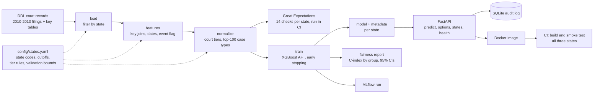

# Case Delay Risk Predictor

Predicts how long an Indian court case will take to reach a decision, using only information known when the case is filed, for three states: **Delhi, Odisha and Bihar**. It is an end-to-end MLOps project: versioned data and models (DVC), config-driven pipelines, data validation, per-group fairness audits with confidence intervals, a multi-state API, Docker, and CI.

The data is the public Development Data Lab (DDL) e-Courts dataset: about 1.75 million cases filed in 2010-2013. Cases with no recorded decision are treated as still pending at a data cutoff date (right-censored), so the model is a **survival model** (XGBoost AFT), not a classifier on decided cases only.

## Results

| State | Cases | Pending at cutoff | C-index, random split | C-index, time split (train 2010-12 filings, test 2013 filings) |
|---|---|---|---|---|
| Delhi | 459,712 | 10.4% | 0.751 | 0.731 |
| Odisha | 470,869 | 39.2% | 0.748 | 0.727 |
| Bihar | 816,809 | 55.8% | 0.799 | 0.803 |

The C-index measures how well the model **ranks** cases by duration (0.5 is random, 1.0 is perfect). It is not comparable across states, because each state has a different censoring rate and case mix. The time-split column is the more realistic estimate, since the real task is predicting new filings from older ones.

What the experiments showed:

- **Model settings barely matter.** Training to convergence at a higher learning rate gained +0.002 to +0.005; tree depth and the AFT error scale added nothing further.
- **States don't share a model.** A pooled model equals per-state models, and a model trained on two states ranks the third only slightly better than chance (C-index 0.56-0.58).
- **Court workload looked like a win and wasn't.** Adding the number of filings in the same court in the prior 90 days raised the C-index by 0.010-0.019 on a random split, but lowered it by 0.005-0.019 on the time split in all three states. It was rejected (the training script keeps it behind an off-by-default `--workload` flag).
- **Civil suits are the hardest to rank.** The Civil Judge (Senior Division) tier has the lowest C-index in all three states, with confidence intervals that don't overlap the best tier. See [docs/fairness_case_study.md](docs/fairness_case_study.md).

## Architecture



Data, models and reports are versioned with DVC (remote on DagsHub). Every stage is defined once in `dvc.yaml` and runs per state from `config/states.yaml`, so adding a state is a config change plus a court-name check. See [docs/architecture.md](docs/architecture.md).

## Quickstart

Pull the processed datasets and models (needs DagsHub credentials in `.dvc/config.local`):

```
pip install -r requirements.txt
dvc pull
```

Rebuilding from raw data also needs the DDL national case files and key tables downloaded into `data/raw/cases/` and `data/raw/keys/` (they are not stored in the DVC remote). Then:

```
dvc repro
```

Run the API locally, or in Docker (after `dvc pull`, because the image copies `models/`):

```
pip install -r requirements-api.txt
uvicorn api.main:app --port 8000

docker build -f Dockerfile.api -t case-delay-api .
docker run -p 8000:8000 case-delay-api
```

Interactive docs are at `http://localhost:8000/docs`. `GET /options/{state}` lists the valid values for each input field. A request:

```
curl -X POST http://localhost:8000/predict -H "Content-Type: application/json" -d '{
  "state": "delhi",
  "type_name_normalized": "hma",
  "court_tier": "Family Court",
  "district_name": "North West",
  "female_defendant": "0 male",
  "female_petitioner": "1 female",
  "female_adv_def": "0 male",
  "female_adv_pet": "0 male"
}'
```

The response contains the predicted days, a Low/Medium/High tier, the top five contributing factors (TreeSHAP, on a log-days scale), the model version, and warnings for any input value the model has not seen. Every prediction is written to an audit table with its state and model version.

## Repository layout

```
config/states.yaml          state codes, cutoffs, tier rules, validation bounds
dvc.yaml, dvc.lock          pipeline: load, features, normalize, train (per state)
scripts/pipeline/           pipeline steps and the cutoff estimator
scripts/train_survival.py   training, bootstrap fairness audit, model metadata
scripts/experiments/        tuning, cross-state and court-workload experiments
validation/                 Great Expectations checks (one script, config-driven)
api/main.py                 multi-state survival API; api/legacy_classifier.py is the v1 classifier API
monitoring/                 drift and fairness dashboards for the v1 classifier
reports/                    per-state fairness reports with confidence intervals
.github/workflows/          data validation matrix, Docker build and smoke test
docs/                       fairness case study, architecture, PRD v2 addendum, demo script
```

## Limitations

- **Use the tier, not the day count.** The model is validated for ranking only. The predicted days have not been checked for calibration, and the Medium/High cut points for Odisha and Bihar lie at or beyond the longest duration the data can show (about 9 years), so they are extrapolations. Tiers are tertiles of predicted days within each state.
- **Features are filing-time only.** Case type, court tier, district and four gender fields. Hearing history and the act or section of a case are not used, which caps accuracy.
- **Pending status is an assumption.** Cases with no decision date are treated as pending at the cutoff. Their listing dates support this (over 99% have a next hearing date), but Bihar's pending share falls for newer filings, the opposite of what pure censoring predicts, and that is unexplained.
- **Court tiers come from hand-written, per-state name rules,** so a tier name in one state is not exactly comparable to the same name in another.
- **Per-group results are single-split estimates.** The confidence intervals resample cases independently, so they understate the uncertainty from cases clustering within courts.
- **Monitoring covers the v1 classifier only.** Drift and fairness dashboards for the survival models are future work.

---

# Development log (chronological)
]633;E;cat README_top.md;82d24239-f3d4-4c80-8d79-03d29aec86a2]633;CA resource-planning tool that flags cases at risk of indefinite delay, built on public eCourts/NJDG data — with fairness and drift monitoring as first-class requirements, not afterthoughts.
## Target Definition & Known Limitations
- Target: days between date_of_filing and date_of_decision
- v1 scope: only cases with a recorded decision date are used for training
  (~11% of Delhi 2012 cases are still pending and excluded)
- Planned v2 improvement: treat pending cases as right-censored
  (survival analysis / classification-style risk bucketing) instead of dropping them
- 29 rows excluded due to corrupted year values in date fields (e.g. "1204" instead of a plausible year)
- 139 rows excluded due to negative days_to_disposition (decision recorded before filing)
- purpose_name decoded via key file join; unmatched/corrupted values imputed as "unknown" post-decode
- District names decoded using the 2010 district key mapping (state_code + dist_code only,
  without year), since cases_district_key.csv has no entry for Delhi in 2012+. District
  boundaries confirmed stable — all 11 dist_codes in the 2012 case data matched the 2010 key.
- Case-type taxonomy: normalized 114 raw categories to 96 by stripping punctuation/
  whitespace and merging one known duplicate (mact/m a c t). Some plural/singular
  variants (e.g. "cr case" vs "cr cases") likely remain as separate categories —
  acceptable for v1, revisit if model performance suggests case-type signal is
  fragmented across near-duplicate labels.
- Court tier derived from court_name's role prefix (5 tiers: District and Sessions
  Judge, Chief Metropolitan Magistrate, Senior Civil Judge cum RC, Principal Judge
  Family Court, POLC and POIT) — used for fairness subgroup monitoring per PRD.
- multiple_hearings proxy: the 5000-01-01 placeholder in date_last_list (330 rows)
  was initially causing all such rows to incorrectly show multiple_hearings=1.
  Fixed by treating the placeholder as missing; these 330 rows now correctly
  show multiple_hearings as unknown (NA) rather than a false positive.
- Model finding: purpose_name="unknown" (~2% of rows) strongly correlates with
  near-immediate case resolution (median 1 day vs. 388 days for cases with a
  recorded purpose). Likely explanation: purpose_name is only populated when a
  case requires a scheduled follow-up hearing — cases resolved immediately
  (allowed, withdrawn, compromised at first hearing) never accumulate one.
  Kept as a legitimate feature rather than excluded, since it reflects a real
  procedural pattern, not a data artifact.

## Fairness Findings (v1 baseline model)
- District: MAE ranges from 307 days (North East) to 535 days (Shahdara) — a ~74%
  relative gap. Correlation between district sample size and MAE is -0.37 (moderate),
  meaning sample-size imbalance partially but not fully explains this — some districts
  are genuinely harder to predict, not just underrepresented.
- Court tier: MAE ranges from ~323 days (Family Court, Sessions Judge) to ~454 days
  (POLC/POIT, Chief Metropolitan Magistrate) — a ~40% relative gap.
- Gender (female_defendant): modest gap (347 days female vs. 393 days male) — smaller
  than district/court-tier disparities. The "-9999 missing name" subgroup has only 5
  test rows and should not be treated as a meaningful estimate.
- Conclusion: real, moderate reliability disparities exist across districts and court
  tiers. Not disqualifying for v1, but flagged as a monitoring priority — a case from
  Shahdara or a POLC/POIT court currently gets a meaningfully less reliable delay
  prediction than one from North East or a Family Court.

## Example: Per-Case Explanation
Case 26-09-02-202100620012016 (Chief Metropolitan Magistrate, West district,
type "cr case", purpose "order"): actual duration 1,341 days, predicted 2,077
days. Model correctly identified this as a high-delay-risk case (1,341 days is
well above the 373-day median) but overestimated the magnitude by ~55% — an
expected outcome given R²=0.43, illustrating that the model has real directional
signal but substantial residual uncertainty in exact day counts. This supports
the plan to reframe as risk-tier classification rather than precise day
prediction for the eventual product.

Note: SHAP values exist for every one-hot encoded column, not just the "active"
category for a given row — only the column matching the case's actual attribute
(e.g. district_name_West=1) reflects that case's own contribution; other
category columns show the model's learned baseline shift from not being in
that category, not signal from this case.

## Week 3 Model Results (v1 Classifier)
- Macro F1: 0.598 — below PRD target of ≥0.75
- Case-type F1 disparity: 73.68% — far exceeds PRD target of <10%.
  Confirmed NOT a sample-size artifact (correlation between subgroup
  size and F1 ≈ -0.02) — this is a genuine, substantial fairness gap.
- Court tier disparity: 13.56%, district disparity: 13.14% — both
  modestly exceed the 10% target.
- Conclusion: v1 classifier, trained on only 6 filing-time categorical
  features from a single state-year, does not yet meet PRD success
  criteria. This is an expected, honest v1 result given the limited
  feature set and single year of data — not a bug. Next steps to close
  the gap: expand training data to Delhi 2010-2013 (previously planned),
  investigate whether additional filing-time features exist, and
  consider per-case-type calibration given the demonstrated disparity.
  - Case type "lac" shows an outlier F1 of 0.947, but this is a class-imbalance
  artifact, not genuine model skill: 94% of "lac" cases (808/858) fall in the
  High risk tier (median 1,876 days), so a trivial always-predict-High rule
  would score similarly. Excluded from the "genuine disparity" interpretation.

  ## Known Gap: CI Workflow Needs Cloud DVC Remote
.github/workflows/data_validation.yml currently references data via the local
DVC remote (/home/srish/dvc-storage/...), which GitHub Actions' runners cannot
access. Before this CI workflow can actually run, it needs a cloud-reachable
DVC remote (e.g. a free-tier S3/GCS bucket or DVC's own hosted storage) and a
dvc pull step added to the workflow. Deferred to Week 4 (CI/CD is explicit
Week 4 PRD scope) rather than fixed now.

Rows with valid target: 413855
New thresholds — Low <= 186, Medium <= 700, High > 700
Feature matrix shape: (413855, 173)

Macro F1 Score: 0.5931
              precision    recall  f1-score   support

         Low       0.63      0.72      0.67     27326
      Medium       0.54      0.38      0.45     27308
        High       0.62      0.70      0.66     28137

    accuracy                           0.60     82771
   macro avg       0.60      0.60      0.59     82771
weighted avg       0.60      0.60      0.59     82771


=== Subgroup Fairness Report: type_name_normalized ===
[arbtn] (n=4753): Macro F1 = 0.4063
[ca] (n=1541): Macro F1 = 0.3494
[civ dj] (n=1164): Macro F1 = 0.4444
[civ suit] (n=3612): Macro F1 = 0.5069
[cr case] (n=2187): Macro F1 = 0.3358
[cr cases] (n=3812): Macro F1 = 0.4126
[cr criminal revision] (n=718): Macro F1 = 0.3392
[cr rev] (n=2175): Macro F1 = 0.3396
[cs] (n=3059): Macro F1 = 0.4355
[cs dj] (n=3703): Macro F1 = 0.4393
[cs dj adj] (n=1130): Macro F1 = 0.4935
[cs scj] (n=5452): Macro F1 = 0.4608
[ct cases] (n=16350): Macro F1 = 0.5136
[e x] (n=67): Macro F1 = 0.2569
[ex] (n=5531): Macro F1 = 0.3719
[ex civil] (n=359): Macro F1 = 0.3313
[ex crl] (n=333): Macro F1 = 0.3795
[gp] (n=328): Macro F1 = 0.5597
[hindu adp] (n=142): Macro F1 = 0.6510
[hma] (n=5318): Macro F1 = 0.5064
[l i d] (n=539): Macro F1 = 0.4284
[l i r] (n=3383): Macro F1 = 0.4420
[lac] (n=300): Macro F1 = 0.3317
[lc] (n=485): Macro F1 = 0.4583
[lca] (n=415): Macro F1 = 0.4443
[m] (n=198): Macro F1 = 0.3537
[mact] (n=3700): Macro F1 = 0.5075
[mc] (n=193): Macro F1 = 0.4863
[mca dj] (n=267): Macro F1 = 0.4386
[mca scj] (n=181): Macro F1 = 0.4260
[misc crl] (n=501): Macro F1 = 0.4927
[misc dj] (n=1657): Macro F1 = 0.3437
[misc scj] (n=1034): Macro F1 = 0.4517
[mt case] (n=913): Macro F1 = 0.4634
[pc] (n=290): Macro F1 = 0.3786
[poit] (n=303): Macro F1 = 0.6053
[ppa] (n=171): Macro F1 = 0.3964
[rc arc] (n=972): Macro F1 = 0.4182
[rca civil dj adj] (n=50): Macro F1 = 0.3575
[rca dj] (n=931): Macro F1 = 0.4346
[rca scj] (n=92): Macro F1 = 0.3997
[rct arct] (n=276): Macro F1 = 0.4354
[sc] (n=2186): Macro F1 = 0.3091
[succ court] (n=605): Macro F1 = 0.4199
[succession court] (n=54): Macro F1 = 0.4656
[tm] (n=122): Macro F1 = 0.4476
[tp c] (n=201): Macro F1 = 0.4859
[tp crl] (n=253): Macro F1 = 0.4950
Max F1 Disparity Gap for type_name_normalized: 39.41%

=== Subgroup Fairness Report: court_tier ===
[Chief Metropolitan Magistrate] (n=21850): Macro F1 = 0.5738
[District and Sessions Judge] (n=34959): Macro F1 = 0.5283
[POLC and POIT] (n=4610): Macro F1 = 0.5397
[Principal Judge Family Court] (n=5090): Macro F1 = 0.5470
[Senior Civil Judge cum RC] (n=16262): Macro F1 = 0.4996
Max F1 Disparity Gap for court_tier: 7.42%

=== Subgroup Fairness Report: district_name ===
[Central] (n=14669): Macro F1 = 0.5628
[East] (n=5726): Macro F1 = 0.4685
[New Delhi] (n=4595): Macro F1 = 0.5565
[North] (n=5852): Macro F1 = 0.5562
[North East] (n=7639): Macro F1 = 0.5643
[North West] (n=8375): Macro F1 = 0.5606
[Shahdara] (n=3639): Macro F1 = 0.4563
[South] (n=5685): Macro F1 = 0.5611
[South East] (n=5521): Macro F1 = 0.5096
[South West] (n=12695): Macro F1 = 0.5750
[West] (n=8375): Macro F1 = 0.5430
Max F1 Disparity Gap for district_name: 11.87%
2026/09/24 10:24:37 WARNING mlflow.models.model: `artifact_path` is deprecated. Please use `name` instead.

## Week 3.2: Feature Addition Experiment (filing_month)
Added filing_month (from date_of_filing, genuinely available at filing time,
no leakage) to test whether seasonality carries signal.

Results: Macro F1 0.593 -> 0.593 (no change). Case-type gap 39.41% -> 35.63%
(marginal). Court tier gap 7.42% -> 7.70% (flat, still under target).
District gap 11.87% -> 13.13% (slightly worse).

Conclusion: two independent attempts to close the Macro F1 gap — 4x more
training data (Week 3.1) and a new filing-time feature (this experiment) —
both failed to move overall performance meaningfully. This is strong,
repeated evidence that the ceiling on this task, given only filing-time
categorical signal (case type, purpose, court, district, gender, month),
is around Macro F1 ~0.59, not the PRD's 0.75 target. Reaching 0.75 likely
requires either features with genuine leakage risk (early case-progress
signal, deliberately excluded in v1 for correctness) or a different
modeling approach (survival analysis, per-case-type threshold calibration).
Documented as the v1 conclusion; not pursued further this session.
## Week 5: Drift Monitoring (Evidently AI)
Simulated a time-sliced drift check using the same 3 fields tracked for
fairness (case type, court tier, district) — reference period: 2010-2011
(183,296 rows), current period: 2012-2013 (231,296 rows).

Results (PSI, threshold 0.1):
- type_name_normalized: 0.110 — DRIFT DETECTED
- court_tier: 0.031 — stable
- district_name: 0.039 — stable

Retrain trigger: fired, correctly isolating case-type distribution as the
source of drift.

This result directly validates a decision already made earlier in this
project: expanding training data from Delhi-2012-only to Delhi 2010-2013
(documented in Week 3.1) was the right call, not just a Macro F1
experiment — a model trained only on 2010-2011 case-type distributions
would have been measurably stale against 2012-2013 data, exactly the kind
of drift this monitor is designed to catch. The retrain that already
happened this session is what a real production system would have done
automatically in response to this exact trigger.

Full interactive report: monitoring/drift_report.html
## Week 5 (cont.): Evidently Fairness Dashboard
Added an Evidently ClassificationPreset report (monitoring/fairness_report.html)
using the same test split as the final model, with type_name_normalized,
court_tier, and district_name included as extra columns — Evidently
automatically breaks down classification quality by these segments,
complementing the custom sklearn-based subgroup audit from Week 3 with
a genuine dashboard artifact.

## Odisha (state code 11): survival model

- **Data:** DDL 2010-2013 filings, 470,869 cases, 181,131 (38.5%) with no decision date.
- **Censoring:** cases with no decision date are treated as still pending at the data cutoff. Checked: 99.7% have last and next listing dates, and only 0.5% were last listed more than 3 years before the cutoff, so they look actively pending rather than stale.
- **Cutoff:** 2019-02-28, taken from where monthly decision volume drops (1,620 to 235). Sensitivity: 2020-12-31 gives C-index 0.7400 vs 0.7435.
- **Model:** XGBoost AFT (`survival:aft`, normal, scale 1.2), filing-time features only (case type, court tier, district, litigant/advocate gender fields).
- **Result:** test C-index 0.7435 (2019-02-28 cutoff). Best-worst C-index gap among groups with at least 1,000 test cases: court tier 0.104 (Judicial Magistrate First Class 0.786 vs Civil Judge Senior Division 0.682), district 0.131 (Nabarangpur 0.791 vs Kendrapada 0.661), case type 0.131 (2(a)cc 0.714 vs mac case 0.583). C-index is not comparable to the Delhi Macro F1 (different target and metric).
- **Limitations:**
  - Absolute predicted durations are not calibrated; use the model for ranking cases.
  - Pending rate differs strongly by district (about 5% in Gajapati to about 66% in Jharsuguda) and is flat across filing years. It is unclear whether this reflects real backlog or district-level recording differences.
  - Mass-disposal dates (e.g. 2014-12-06, 2015-12-12) cluster many decisions on single days.
  - Delhi uses a classifier with pending rows dropped; the two states are not yet on one modeling approach.
  - Case-type spelling variants are still split across categories (e.g. `uc` and `uc case`, `gr` and `gr case`), which dilutes the per-type audit. Per-group C-index also depends on each group's censoring rate, so gaps are not a direct fairness measure.

## Bihar (state code 08): survival model

- **Data:** DDL 2010-2013 filings, 816,809 cases, 54.5% with no decision date (61.3% of 2010 filings falling to 50.4% of 2013 filings).
- **Censoring:** cases with no decision date are treated as still pending at the cutoff. Checked: 99.3% of pending cases have a next listing date, and only 0.9% were last listed more than 3 years before the cutoff.
- **Cutoff:** 2019-05-31, estimated as the end of the month of the 90th percentile of pending cases' last listing date. The same rule gives 2019-02-28 for Odisha, matching the value found from its decision-volume drop.
- **Model:** XGBoost AFT, same setup and filing-time features as Odisha. It reached the 1,500-round cap without early stopping, so it is not fully converged.
- **Result:** test C-index 0.7963. Best-worst C-index gap among groups with at least 1,000 test cases: court tier 0.196 (District and Sessions Judge 0.851 vs Civil Judge Senior Division 0.655), district 0.189 (Patna 0.828 vs Araria 0.639), case type 0.281 (other 0.811 vs gr/police cases 0.530).
- **Limitations:**
  - The pending share falls for newer filing years, the opposite of what pure right-censoring predicts. The listing checks say the pending cases are active, but this pattern is unexplained.
  - Court-tier names are matched by a Bihar-specific rule set. `Civil Judge (division unclear)` merges senior and junior civil courts (4.2% of cases), 2.2% of cases stay unclassified (e.g. `Criminal Proceeding`, `JJPDJ`), and 63% of cases fall in Chief Judicial Magistrate courts.
  - The C-index depends on each state's censoring rate and case mix, so it is not comparable across states or with the Delhi Macro F1. Part of Bihar's headline value comes from separating court tiers.

### Training-length experiment (Odisha, Bihar)

Both DVC training stages use learning rate 0.05 with a 1,500-round cap and reach the cap without early stopping. A separate sweep (`scripts/experiments/tune_survival.py`) found that training to convergence at learning rate 0.10 gives test C-index 0.7484 on Odisha (+0.005) and 0.7985 on Bihar (+0.002). On Odisha, tree depth 8 and AFT scale 0.8 or 2.0 added nothing further (all within 0.001 on validation). The stages were left at the original setting because the gain is small.

## Delhi (state code 26): survival mode

- **Data:** DDL 2010-2013 filings, 459,712 cases, about 10% with no decision date. The original Delhi classifier drops those cases and is unchanged; this is a separate `delhi_survival` entry.
- **Censoring and cutoff:** same rule as Odisha and Bihar. Cutoff 2019-02-28, estimated from pending cases' last listing dates and consistent with the drop in monthly decisions (1,649 in Jan 2019, 607 in Feb, 161 in Mar). 99.9% of pending cases have a next listing date.
- **Model:** XGBoost AFT, same setup and features as the other states. It reached the 1,500-round cap without early stopping.
- **Result:** test C-index 0.7499. Best-worst C-index gap among groups with at least 1,000 test cases: court tier 0.149 (Family Court 0.769 vs Civil Judge (Senior Division) 0.620); district 0.138 (North West 0.779 vs Shahdara 0.641); case type 0.138 (ct cases 0.710 vs misc dj 0.572).
- **Limitations:** court tiers come from a Delhi-specific rule set, with two tiers that exist only in Delhi (Family Court, Labour / Industrial Tribunal). The C-index is not comparable with the old classifier's Macro F1 of 0.59.

## Cross-state experiment (Delhi, Odisha, Bihar)

`scripts/experiments/cross_state.py` compares three setups on the same features (case type, court tier, four gender fields; district is excluded because district names are state-specific), with learning rate 0.10 and early stopping.

| Evaluated on | In-state | Pooled (+ state feature) | Trained on the other two |
|---|---|---|---|
| Delhi | 0.726 | 0.726 | 0.584 |
| Odisha | 0.710 | 0.710 | 0.558 |
| Bihar | 0.755 | 0.755 | 0.583 |

- Pooling did not improve any state, and a model trained on the other two states ranks cases only slightly better than chance (0.56-0.58). With these features, per-state models are needed.
- Part of the hold-out gap reflects label mismatch (state-specific court-tier rules, tiers that exist only in Delhi, different case-type spellings), so it is not a clean measure of how different the states' courts are.
- Dropping district lowers the in-state C-index by about 0.02-0.04 compared with the full-feature runs, so district carries real signal.
- The pooled fits reached the 3,000-round cap, and all numbers come from a single train/test split.
