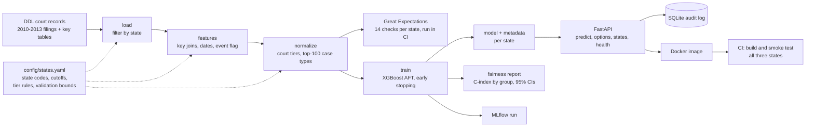

# Architecture

## Pipeline stages (`dvc.yaml`)

| Stage | Input | Output | Notes |
|---|---|---|---|
| `load@state` | national case files per year | the state's rows per year | filters by state code |
| `features@state` | state rows + key tables | features file | joins case type, court and district names; keeps pending cases with an `event` flag |
| `normalize@state` | features file | normalized file | maps court names to tiers with a per-state rule set; keeps the top 100 case types |
| `train_*` | normalized file | model, feature list, metadata, fairness report | early stopping, bootstrap confidence intervals, tier cut points |

Survival-mode datasets are stored as `.csv.gz`, because uploads of the 150-260 MB uncompressed files to the DVC remote kept failing.

## Configuration

`config/states.yaml` holds, per state: the state code, the file slug, whether pending cases are kept, the data cutoff date used for censoring, the court-tier rule set, and the validation bounds (row count and share of decided cases). Adding a state means adding an entry, adding it to the `foreach` lists in `dvc.yaml`, and checking its court names.

The cutoff for each state is estimated from the data (`scripts/pipeline/estimate_cutoff.py`): the end of the month containing the 90th percentile of pending cases' last hearing dates. It reproduces the cutoff found by hand from the drop in monthly decisions.

## Serving

`api/main.py` loads every state's model at start-up from `models/*_aft_meta.json`. Endpoints: `POST /predict`, `GET /options/{state}`, `GET /states`, `GET /health`. Each prediction returns predicted days, a Low/Medium/High tier (tertiles of predicted days on the state's test set), the top five TreeSHAP factors, the model version, and warnings. Every request is stored in the `survival_predictions` table of a SQLite audit log.

## CI (GitHub Actions)

- **Data validation:** one job per dataset (a matrix), each pulling only the file it validates from the DVC remote and running the Great Expectations checks.
- **Docker build and smoke test:** pulls the model files, builds the image, starts the container, and sends a valid request for each state, checking the response and the audit log write.
